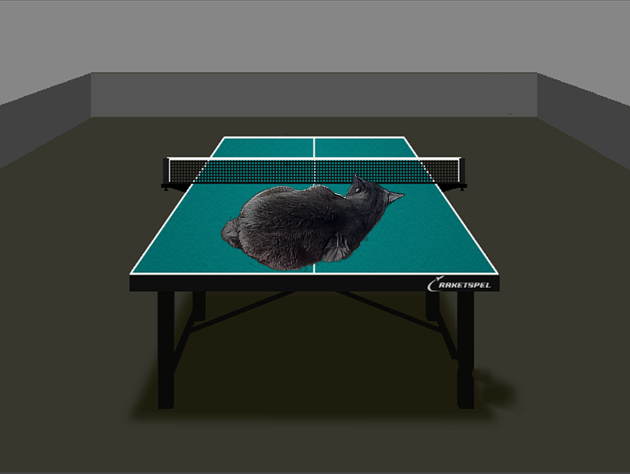

# Optimisation of alpha-blending algorithm

## Introduction
In this work I tried to optimise algorithm of merging pictures by using available on my computer SIMD instructions: SSE and AVX2

## Alpha-Blending algorithm
This algorithm is widely used for merging pictures. Where are 2 pictures: back- and foreground, 2nd one should be imposed on the 1st. When 2 pictures of the same size given as arrays of pixels in RGB format, every pixel has 4 components:

``(Red, Green, Blue, Alpha)``

To merge pictures with the same size algorithm runs every pixel of both pictures (arrays ``front`` and ``back``) and calculates pixels of resulting picture (array ``screen``) using simple rool:

``screen_clr = front_clr * front_alpha + back_clr * (1-front_alpha)``, where ``front_alpha`` is normalized alpha coefficent of the pixel of the front picture

So perfomance of algorithm depends on amount of pixels in resulting picture:

``t ~ width * height``

## Using data
In our case, there are 2 pictures given:

As a result cat have to appear on the table. Resulting picture has the same size as picture with table: ``800*600``, so number of operating pixels in algorithm is ``600*800 = 480000``. It remains time to process all of them.

## Optimisation principle
Principles using SSE and AVX2 instructions are different:

### SSE optimisation:
We are able to process 4 pixels at the same time by using __m128i variables, so let's do it. Here is mechanism of optimisation described step-by-step:

1) Loading data from Front and Back pixel arrays:
    __m128i front = Front[i]
    __m128i back  = Back[i]

    used commands: _mm_load_si128

2) Splitting pixels data on 2 variables (higher (1,2) and lower (3,4) pixels):
    __m128i front -> __m128i frontH, __m128i frontL
    __m128i back  -> __m128i backtH, __m128i backL

    used commands: _mm_movehl_ps

3) Converting all variables to the format  below for mulling:
    |index|[15]|[14]|[13]|[12]|[11]|[10]|[09]|[08]|[07]|[06]|[05]|[04]|[03]|[02]|[01]|[00]|
    |:----|:--:|:--:|:--:|:--:|:--:|:--:|:--:|:--:|:--:|:--:|:--:|:--:|:--:|:--:|:--:|:--:|
    |value| ri | 00 | gi | 00 | bi | 00 | ai | 00 | rj | 00 | gj | 00 | bj | 00 | aj | 00 |

    used commands: _mm_cvtepu8_epi16

4) Getting alpha parameters in the same format
    |index|[15]|[14]|[13]|[12]|[11]|[10]|[09]|[08]|[07]|[06]|[05]|[04]|[03]|[02]|[01]|[00]|
    |:----|:--:|:--:|:--:|:--:|:--:|:--:|:--:|:--:|:--:|:--:|:--:|:--:|:--:|:--:|:--:|:--:|
    |value| ai | 00 | ai | 00 | ai | 00 | ai | 00 | aj | 00 | aj | 00 | aj | 00 | aj | 00 |

    __m128i frontL -> __m128i alphaL
    __m128i frontH -> __m128i alphaH

    used commands: _mm_shuffle_epi8
    __m128i alpha_shuffle_mask = {128, 14, 128, 14, 128, 14, 128, 14,   128, 6, 128, 6, 128, 6, 128, 6}

5) Mulling front and back colors on alphas
    frontL *= alphaL        , frontH *= alphaH
    backL  *= (255 - alphaL), backH  *= (255 - alpkaH)

    used commands: _mm_mullo_epi16, _mm_sub_epi16

6) Summing front and back colors
    __m128i sumL = frontL + backL
    __m128i sumH = frontH + backH

    used commands: _mm_add_epi16

7) Normalizing sums
    sumL = sumL >> 8
    sumH = sumH >> 8

    used commands: _mm_shuffle_epi8
    __m128i sum_shuffle_mask = {128, 128, 128, 128, 128, 128, 128, 128, 15, 13, 11, 9, 7, 5, 3, 1}

8) Storing all 4 result pixels in result var
    sumH, sumL -> __m128i screen

    used commands: _mm_movelh_ps

9) Loading result pixels to the Screen array
    Screen[i] = screen

    used commands: _mm_store_si128

### AVX2 optimisation:

## Perfomance
To evaluate and compare the speed of working algorithms I calculate fps value of 10 cycles of Alpha-Blending:

``fps = 1 / blending_time``

It's important to evaluate the time correctly, so when I do it, app don't draw anything in SFML, just operaties with arrays

Evaluations made with precision of measuring ~ 0.3 s^(-1)

|optimisation \ flag|None   |-O0 |-O1  |-O2  |-O3     |-Ofast|
|:------------------|:-----:|:--:|:---:|:---:|:------:|:----:|
|no optimisation    |9.9    |9.9 |12.5 |12.9 |12.9    |12.9  |
|SSE inctructions   |9.6    |9.3 |148.3|150.7|151.2   |150.9 |
|AVX2 instructions  |       |    |     |     |        |      |

## Results
The result of running programm in the DRAW_MODE:

